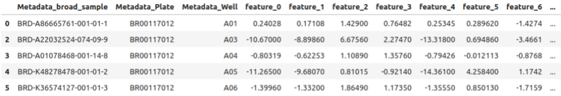

## Cell line transferability challenge 

### Overview

In this challenge, you will develop machine learning models for learning representations of molecular perturbations in cellular systems using microscopy imaging data.

### Description

Learning representations of molecular perturbations in cells is a crucial task in drug discovery. Having robust representations that capture how certain perturbations affect cells would allow us to rapidly find compounds that present similar effects. However, experimental and other types of variability unrelated to the perturbation’s biological effect make it a challenging task. Therefore, we present a compound classification task where models will be evaluated both in unseen plates and unseen cell lines. 

### Dataset

The competition will use the publicly available 2020_11_04_CPJUMP1 dataset, see [description](https://github.com/jump-cellpainting/2024_Chandrasekaran_NatureMethods). The dataset contains images generated using chemical and genetic perturbation and 2 cell lines: U2OS and A549 in multiple replicates. Images and corresponding CellProfiler features are available. 

### Task

Develop a method for transfer of information between cell lines using either *CellProfiler* features or raw images (Deep Learning method). Provide an image representation for each compound-containing well in 24 compound plates. The input file should be a csv file and contain following information:
Metadata_broad_sample, e.g. BRD-A86665761-001-01-1. Compound identifier from the dataset.
Metadata_Plate, e.g. BR00117012. Plate identifier.
Metadata_Well, e.g. A01. Well identifier.
feature_{i} from 0 to the length of your feature vector. One feature value per column.

Features should not have any missing or infinite values. 

### Evaluation

The generated representations will be evaluated in a compound classification task using the kNN algorithm in 5-fold cross-validation. Metrics will be calculated using inter and intra cell line matching. Train/test split will be undisclosed but follows plate-wise split. Evaluation will be performed using only compound plates of 2020_11_04_CPJUMP1 dataset and will omit DMSO well but any data can be used to develop and train a method. Participants will also be asked to send a paper describing the methodology (up to 4 pages without citations).

Inter and intra cell line matching:
- Train using U2OS data, evaluate using U2OS data.
- Train using U2OS data, evaluate using A549 data.
- Train using A549 data, evaluate using U2OS data.
- Train using A549 data, evaluate using A549 data.

The evaluation system will be opened on February 15th 2024.

### Outcomes

Teams that will obtain the best results may be invited to collaborate on a joint publication. 

### Timeline:

Start (call for participation): January 20 '25 07:59 AM UTC

Registration deadline: February 15 '25 07:59 AM UTC

Submission deadline: March 15 '25 07:59 AM UTC

Decisions to participants: May 1 '25 07:59 AM UT

## Challenge organizers:

|  | **Adriana Borowa**   **Ardigen SA** | 
|:-----------------:|:-----------------:|
|  | **Ana Sanchez-Fernandez   Johannes Kepler University Linz** | 

[back](./)
