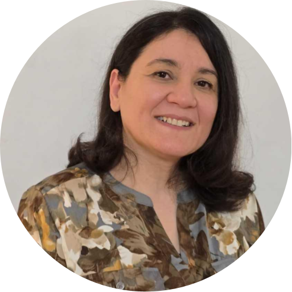

| [CVPR 2025](https://cvpr.thecvf.com/Conferences/2025/Dates) | [Call for papers](./call.html) | [Speakers](./speakers.html) | [Challenge](./challenge.html) | [Organizers](organizers.html) |

This page is for CVPR 2025 workshops on Computer Vision for Drug Discovery: Where Are We and What is Beyond?

## Introduction

The workshop aims to bridge the gap between computer vision, artificial intelligence, and the life sciences, with a focus on transformative advancements in drug discovery. By integrating innovative imaging modalities—such as Spatial Transcriptomics, Cell Painting, and Optical Pooled Screening—with state-of-the-art computer vision techniques, this workshop seeks to foster collaboration between experts in biomedical science, AI, and computer vision.

The workshop highlights the potential for revolutionizing drug discovery processes, driving faster and more accurate identification of therapeutic targets, and expediting the development of treatments for complex diseases. Addressing pressing challenges like cancer, neurodegenerative disorders, and pandemics, the focus lies on leveraging AI to analyze high-dimensional biological data, enhancing our understanding of disease mechanisms and responses to therapies.

For the CVPR community, this represents an exciting opportunity to expand beyond traditional image processing tasks into applications with tangible societal impact. By applying computer vision expertise to critical healthcare and pharmaceutical challenges, participants will engage with tasks like multi-modal data fusion, enhancing explainability in biomedical applications, and addressing the unique complexities of biological imaging, such as sparse or noisy datasets.

This workshop is aligned with CVPR's growing emphasis on "AI for social good," offering computer vision researchers a platform to contribute to advances in medical science that could improve the lives of millions. It is a call to action for interdisciplinary innovation, uniting diverse expertise to tackle some of the most critical challenges in global health.

## Speakers

TBD

## Call for papers:
Two tracks are available: featuring papers for workshop proceedings and posters from recent publications in top conferences like CVPR, ICCV, ECCV, NeurIPS, ICLR, and AAAI, as well as prominent journals such as Nature, Science, and Nature Methods.

The papers must follow the CVPR paper template. 

The submission must go through: TBD

### Topics

* Spatial Transcriptomics for Drug Discovery

* Cell Painting and Morphological Profiling

* Optical Pooled Screening and Functional Genomics

* AI for Multi-modal Biomedical Imaging

* Explainable AI and Predictive Modeling in Drug Discovery

* Sparse Labelled Data in Drug Discovery Domain

* AI-driven Drug Discovery Pipelines

* Imaging Biomarkers Discovery:

* Safe and Trustworthy Computer Vision for Drug Discovery and Clinics:

### Dates

Paper Submission Deadline: March 1 '25 07:59 AM UTC

Notification of Acceptance: April 1 '25 07:59 AM UTC

Camera-Ready Deadline: April 7 '25 07:59 AM UTC

Final workshop program: May 9 '25 07:59 AM UTC

Workshop Date: June 12

## Challenge: 

### Overview

In this challenge, you will develop machine learning models for learning representations of molecular perturbations in cellular systems using microscopy imaging data.

### Description

Learning representations of molecular perturbations in cells is a crucial task in drug discovery. Having robust representations that capture how certain perturbations affect cells would allow us to rapidly find compounds that present similar effects. However, experimental and other types of variability unrelated to the perturbation’s biological effect make it a challenging task. Therefore, we present a compound classification task where models will be evaluated both in unseen plates and unseen cell lines. 

More info can be found at: [Challenge](./challenge.html)

## Organizing team:

### Workshop comitee:

|  | **Dawid Rymarczyk   Ardigen SA   Jagiellonian University** | 
|:-----------------:|:-----------------:|
|  | **Ilknur Icke   Novo Nordisk** | 
|  | **Chao-hui Huang   Pfizer** | 
|  | **Gayathri Mohan   AstraZeneca** | 
|  | **Anne Carpenter   Broad Institute   SyzOnc** |

### Challenge comitee:

|  | **Adriana Borowa   Ardigen SA** | 
|:-----------------:|:-----------------:|
|  | **Ana Sanchez-Fernandez   Johannes Kepler University Linz   Janssen Pharmaceutica** | 

 