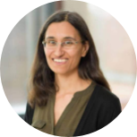
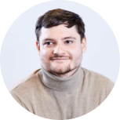

|  | **Shantanu Singh   Broad Institute** | TBD | TBD |
|:-----------------:|:-----------------:|:-----------------:| :-----------------:|
|  | **Christina S Leslie   Memorial Sloan Kettering     Cancer Center** |  TBD | TBD |
|  | **Juan C Caicedo   Morgridge Institute for Research** | Toward foundation models   of cellular morphology.| Cellular morphology is a biologically meaningful readout that can be obtained from microscopy images of different types, and has applications in drug discovery and functional genomics.   Deep learning models for cellular morphology are often trained for a specific type of microscopy image, such as brightfield or a fluorescent panel with a set number of channels.   This makes reusing models from one experiment to another difficult, because the channels do not always match across experiments.   Here, we describe our efforts to create foundation models that can be reused across different types of imaging experiments, which are channel adaptive, don’t require training from scratch, and can match or surpass the performance of specialized models.|
|  | **Jean Fan   Johns Hopkins   Biomedical Engineering** |  Multi-sample comparative   spatial omics data analysis | Recent advances in high-throughput spatially resolved transcriptomics technologies now enable high-throughput molecular profiling of cells while maintaining their spatial organization within tissues.   Application of these technologies provides the opportunity to contribute to a more complete understanding of how cellular spatial organization relates to tissue function and how cellular spatial organization is altered in disease.   New statistical approaches and scalable computational tools are needed to connect these molecular states and spatial-contextual differences.   In this talk, I will provide an overview of spatially resolved transcriptomics technologies and associated computational analysis methods developed by my lab.   Specifically, to facilitate spatial molecular comparisons across structurally matched tissue sections from replicates, we developed STalign to align ST datasets in a manner that accounts for partially matched tissue sections and other local non-linear distortions using diffeomorphic metric mapping.   Likewise, to facilitate comparison cell-type spatial organizational patterns, we developed CRAWDAD, Cell-type Relationship Analysis Workflow Done Across Distances, to quantify pair-wise cell-type spatial relationships across length scales.   We demonstrate how such multi-scale characterization enabled by CRAWDAD can be used to compare cell-type spatial relationships across multiple samples to identify consistent as well as patient and sample-specific cell-type spatial relationships.   We anticipate that such statistical approaches and computational methods for analyzing spatially resolved transcriptomic data will offer the potential to identify and characterize the heterogeneity of cells within their spatial contexts and contribute to important fundamental biological insights regarding how tissues are organized in both the healthy and diseased settings. |
|  | **Patrick Schwab   GSK** |  TBD |
|  | **Peter Horvath   Szeged, Helsinki,   ETH Zurich, INRIA,   Sophia Antipolis** |   TBD |
|  | **Daniel Racoceanu   Sorbonne University** |  TBD |

[back](./)

