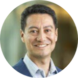
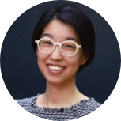

|  | **Shantanu Singh   Broad Institute** | TBD | TBD |
|:-----------------:|:-----------------:|:-----------------:| :-----------------:|
|  | **Christina S Leslie   Memorial Sloan Kettering     Cancer Center** |  TBD | TBD |
|  | **Juan C Caicedo   Morgridge Institute for Research** | Toward foundation models   of cellular morphology.| Cellular morphology is a   biologically meaningful readout   that can be obtained from microscopy images of   different types, and has applications in drug discovery   and functional genomics.   Deep learning models for cellular morphology are often trained   for a specific type of microscopy image, such as brightfield   or a fluorescent panel with a set number of channels. This makes reusing models   from one experiment to another difficult, because the channels do not always match across experiments.   Here, we describe our efforts to create   foundation models that can be reused across   different types of imaging experiments, which are channel adaptive, don’t require   training from scratch, and can match   or surpass the performance of specialized models.|
|  | **Jean Fan   Johns Hopkins   Biomedical Engineering** |  TBD |
| TBD | **More to come!** | TBD |

[back](./)

